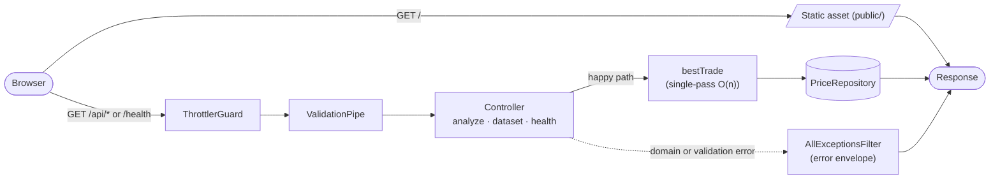

# Stock Price Analyzer

Live URL: https://stock-analyzer-production-b678.up.railway.app/

A NestJS web app that finds the optimal buy/sell pair within a chosen time slice of an intraday price series, optimising profit per share.

## What it is

The dataset is a synthetic intraday tick series for a fictional ticker called **ACME** (23,400 ticks at second precision, covering the 2026-04-22 trading day from 09:30:00 UTC to 15:59:59 UTC). The **best-trade** algorithm finds the index pair `(buy, sell)` with `buy < sell` that maximises `prices[sell] - prices[buy]`. It runs in a single O(n) pass with a running minimum: as the loop advances, it tracks the lowest price seen so far and updates the best `(buy, sell)` pair whenever the current price minus the running min beats the previous best profit. Tiebreaker: earliest-buy primary, earliest-sell secondary. The implementation is in [`src/analysis/best-trade.ts`](src/analysis/best-trade.ts) (~30 lines, no dependencies).

## Architecture

The application is a single NestJS process serving both the static frontend and the JSON API from the **same origin**. Internally the structure is intentionally flat: a top-level `AppModule` registers configuration validation (Zod via `@nestjs/config`), structured JSON logging (`nestjs-pino`), per-IP throttling (`@nestjs/throttler` — 60/min on `/api/analyze`, 120/min on `/api/dataset`, `/health` skipped), and a single feature module — `DataModule` — that exposes `PriceRepository` (currently backed by `FilePriceRepository`, swappable). The three HTTP controllers (`AnalyzeController`, `DatasetController`, `HealthController`) belong to `AppModule` directly, kept un-modulised because there's a single bounded context. The algorithm itself is a pure function the analyze controller calls — not wrapped in a NestJS module because there's nothing to inject.

Cross-cutting concerns sit around the request flow rather than inside it: **Helmet** sets a strict CSP with two carve-outs from defaults — `style-src 'self' 'unsafe-inline'` for Pico CSS's inline form-element styles, and `script-src 'self' 'unsafe-eval'` because Alpine.js v3 evaluates every `x-*` directive expression at runtime via `new Function(...)` (without `'unsafe-eval'`, every directive throws and the page fails to render — verified empirically by removing the carve-out and observing 20+ `EvalError` exceptions and a stuck "Loading…" placeholder); **structured JSON logging** via `nestjs-pino` runs in every environment with no pretty-printer (dev/prod log parity); **error envelopes** are uniform — `{ statusCode, error, message, code }` where `code` is one of `INVALID_TIMESTAMP`, `INVALID_RANGE`, `OUT_OF_BOUNDS`, `DATA_UNAVAILABLE`, `INTERNAL_ERROR`; **same-origin** static + API serving means **no CORS middleware** is needed and none is configured.

For deeper rationale see [`docs/01-stock-analyzer-analysis.md`](docs/01-stock-analyzer-analysis.md). For the contract see [`docs/02-stock-analyzer-brief.md`](docs/02-stock-analyzer-brief.md).

## Run locally

**Prerequisites:** Node.js `>=22.0.0` (enforced via `package.json`'s `engines` field). **npm 11+ recommended** (older versions silently ignore `.npmrc`'s `min-release-age` directive — installs still work, but the dependency-cooldown safeguard isn't applied).

1. `git clone <repo>` and `cd stock-analyzer`.
2. `npm install`. With npm 11+, the first install honours the 7-day `min-release-age` cooldown for any dependency newer than that threshold.
3. `cp .env.example .env`. Defaults work as-is for local dev.
4. `npm run start:dev`. Server starts on `http://localhost:3000`.
5. (Optional) `npm run generate:mock-data` regenerates [`data/acme.json`](data/acme.json) from the seeded RNG. Output is byte-identical across machines (seed `0xACE`).

## Run tests

- `npm test` — unit + integration tests across 6 suites (algorithm + tiebreaker + brute-force property test, repository + boot-time integrity check, API controllers + DTO validation, throttler + skip-on-`/health`, static-serving route precedence, exception envelope).
- `npm run test:e2e` — minimal e2e against `/health`, ensures the bootstrap path doesn't regress.
- `npm run lint`, `npm run typecheck`, `npm run build` — quality gates also enforced by CI and the pre-commit hook.

## CI

[`.github/workflows/ci.yml`](.github/workflows/ci.yml) runs on push and PR to `main`: install (cached), `npm run lint`, `tsc --noEmit`, `npm test`, `npm run build`, `npm audit --audit-level=high`. Husky pre-commit hook (skipped in CI via the `HUSKY=0` env var; CI also doesn't run `git commit`, so the hook would never fire even without the env var) runs lint-staged (`eslint --fix` + `prettier --write` on staged files) and `tsc --noEmit` so quality issues fail at commit time, not at CI time.

## Tiebreaker interpretation

Multiple optimal trades can tie on profit. The brief's phrase "earliest and shortest" admits two readings:

- **(a) earliest-buy-primary** — among optimal pairs, prefer the smallest buy index.
- **(b) shortest-duration-primary** — among optimal pairs, prefer the smallest `sell - buy` index gap.

On real intraday data the two readings produce the same answer in practice (genuine ties on both profit and buy index are rare). We chose **(a) earliest-buy-primary** because it matches the trader's intuitive question — _"when should I have entered?"_ — entry time, not time-in-market. Worked example:

> Prices `[5, 6, 5, 6]`. Maximum profit is 1, achievable two ways: buy at index 0, sell at index 1; or buy at index 2, sell at index 3. The earliest-buy-primary rule selects the first pair (index 0 → index 1). If two pairs tie on both profit _and_ buy index, the earliest-sell secondary rule chooses between them.

The choice is documented at the algorithm layer ([`src/analysis/best-trade.ts`](src/analysis/best-trade.ts)) and asserted by the tiebreaker tests.

The **funds rule** is `floor(availableFunds / buyPrice)` shares, computed entirely client-side. The server never sees funds — it only ever returns the optimal trade and per-share profit.

## Postman

A collection is included at [`docs/stock-analyzer.postman_collection.json`](docs/stock-analyzer.postman_collection.json). Import it into Postman and click any request — it works out of the box: the collection's `baseUrl` defaults to the deployed Railway URL. Override `baseUrl` to `http://localhost:3000` if running the app locally via `npm run start:dev`. Folders: **Health** (1 request), **Metadata** (1 request), **Happy path** (4 requests covering the full window plus three engineered sub-windows), **Errors** (3 requests demonstrating each documented error code).

## Future work

Not committed; listed for reviewers' interest:

- Price chart of the selected window (mentioned in the brief as an optional enhancement).
- Richer tiebreaker UX: tell the user when multiple optimal pairs existed, not just which one was selected.
- WebSocket streaming for live tickers, replacing the file-backed repository.
- Per-user funds persistence (currently funds is purely a per-page-load client-side input).

## Acknowledgments

- [Pico CSS](https://picocss.com/) — semantic-default styling, no class gymnastics.
- [Alpine.js](https://alpinejs.dev/) — reactive frontend without a build step.
- [NestJS](https://nestjs.com/) — opinionated TypeScript backend framework.
- Built with [Claude Code](https://docs.anthropic.com/en/docs/claude-code) as the implementation tool, under human-driven architecture, design decisions, and phase-by-phase verification (see [`CLAUDE.md`](CLAUDE.md) and [`docs/phases/`](docs/phases/) for the discipline).

## For evaluators

Time-pressed reviewers — read in this order:

- [`src/analysis/best-trade.ts`](src/analysis/best-trade.ts) — the algorithm itself: single-pass O(n) running-min with explicit tiebreaker. Read this first; it's the heart of the take-home.
- [`src/analysis/best-trade.spec.ts`](src/analysis/best-trade.spec.ts) — TDD example sequence, hand-crafted tiebreaker cases, and the brute-force property test (100 random arrays compared against an O(n²) reference). Shows the test-first discipline in action.
- [`src/api/api.spec.ts`](src/api/api.spec.ts) — integration tests via `Test.createTestingModule`: happy path, all error codes, validation, throttler 429, `/health` bypass. Single file covering the full HTTP surface.
- [`data/acme.json`](data/acme.json) — the committed deterministic dataset (regeneratable via `npm run generate:mock-data` from seed `0xACE`).

## Further reading

- [`docs/01-stock-analyzer-analysis.md`](docs/01-stock-analyzer-analysis.md) — rationale: why this design, why these tradeoffs.
- [`docs/02-stock-analyzer-brief.md`](docs/02-stock-analyzer-brief.md) — the contract: what's in scope, what isn't.
- [`docs/03-implementation-plan.md`](docs/03-implementation-plan.md) — phased execution roadmap. Per-phase requirements + tasks under [`docs/phases/`](docs/phases/).
